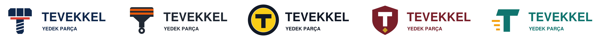

# Tevekkel Yedek Parça — Logo Tasarım Süreci

Python ile üretilen, kod tabanlı bir marka kimliği çalışması. 1978'den beri
Düzce merkezli otomotiv yedek parça satan Tevekkel için beş farklı logo
yönü, her biri kendi renk paleti ve anlamıyla birlikte geliştirildi.



## İçerik

| Yön | Kavram | Ana renk | Vurgu rengi |
|---|---|---|---|
| 1. Cıvata | Sağlam bağlantı | `#12294D` | `#D93A2F` |
| 2. Piston | Motorun gücü | `#1F2933` | `#E8590C` |
| 3. Jant / Lastik | Yolda güvenlik | `#111827` | `#FACC15` |
| 4. Kalkan | Güvenin adresi | `#7A1F2B` | `#C9A227` |
| 5. Hız Çizgileri | Hızlı tedarik | `#0F766E` | `#F59E0B` |

Her yönün amblemi, T harfini farklı bir otomotiv/mekanik nesnesiyle
(cıvata, piston, jant, kalkan, hız çizgisi) birleştirerek "Tevekkel"
markasını sektöre bağlıyor.

## Bu depoda ne var

```
generate_tevekkel_logos.py     # Tüm çıktıları üreten Python betiği
cikti/
  tevekkel-logo-1-civata.svg   # Vektörel logo dosyaları (5 adet)
  tevekkel-logo-1-civata.pdf   # Baskıya hazır PDF sürümleri (5 adet)
  Tevekkel-Logo-Sunumu.pptx    # Anlam, renk paleti ve tipografiyi
```

## Nasıl çalıştırılır

```bash
pip install svglib reportlab pymupdf python-pptx
python3 generate_tevekkel_logos.py cikti
```

Betik saf Python kütüphaneleri kullanır; sistemde ek olarak Cairo gibi
bir kütüphane kurmanız gerekmez. Bir logonun rengini veya metnini
değiştirmek için dosyanın başındaki `LOGOS` listesini düzenleyip
betiği yeniden çalıştırmanız yeterli.

## Tasarım süreci

Bu logo, tek seferde değil, art arda eleştiri ve revizyon turlarıyla
şekillendi: önce bir dişli/T amblemiyle başlandı, sırasıyla cıvata,
piston gibi yönler denendi, her turda önceki tasarımın zayıf noktaları
(okunurluk, küçük boyutta bozulma, sektörle bağının zayıflığı) not
edilip düzeltildi. Beş final yön, bu sürecin sonunda bir arada
sunuluyor; nihai seçim bayi ve çalışan geri bildirimiyle
netleştirilecek.

## Sınırlar ve sonraki adımlar

- Yazı tipi SVG dosyalarında `Helvetica-Bold`; nihai kullanım öncesi
  lisanslı bir font seçilip harflerin eğriye çevrilmesi önerilir.
- Beş yön de tasarım taslağıdır; kullanıcı testi ve benzer logo
  taraması yapılmamıştır.
- Marka tescili öncesi bir avukat/marka vekiliyle görüşülmesi önerilir.

## Lisans

Bu logo taslakları Tevekkel Yedek Parça için hazırlanmıştır ve firmanın
kendi kullanımına aittir.
